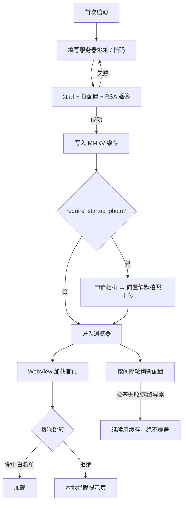

# 校园浏览器 · APP 端

**受管 WebView 壳**：服务端下发 RSA 签名配置，平板按白/黑名单强制跳转管控。面向教室平板、电子班牌的统一上网管理。


-3ddc84)


| 项 | 值 |
| --- | --- |
| 包名 / 版本 | `edu.campus.browser` · versionCode 11 · versionName 0.8.1 |
| 运行环境 | Android 7.0+（minSdk 24）/ targetSdk 34 / 系统 WebView |
| 体积 | release 约 3.72 MB（R8 混淆 + 资源压缩，仅 arm64-v8a / armeabi-v7a） |
| 签名 | debug keystore（SHA-256 `9E:18:19:8C:...:97:B4`），**可覆盖安装旧版** |
| **服务端** | 需 v0.8.0+（新增字段全部可选，旧服务端仍可用） |

---

## 工作流



## 功能

| 模块 | 能力 |
| --- | --- |
| **受管浏览** | WebView 强制白/黑名单（域名 / `host:端口` / 路径前缀，不看协议）；禁长按菜单、禁下载、禁缩放，地址栏受管时只读 |
| **快捷书签** | 工具栏一键打开；白名单模式下自动放行；**长按条目可「添加到桌面」**，桌面图标点一下直接进该书签页 |
| **桌面快捷方式** | Android 8+ 用 `ShortcutManager.requestPinShortcut`，老桌面回退 `INSTALL_SHORTCUT` 广播；各 ROM 支持不一会有提示；从快捷方式启动跳过拍照门控 |
| **内置 HTML 页** | 服务端托管页 `/h/xxx` 在书签列表带 🏫 标记，可打开、可钉桌面 |
| **扫码 / 唤醒应用** | ZXing 扫码（网址或 `app://包名`）；WebView 自定义 scheme 按服务端白名单拉起，工具栏「应用」按钮快速启动 |
| **启动拍照** | 服务端开关控制；无前置摄像头则上报跳过；拍照/上传失败缓存，下次启动补传 |
| **输错拍照** | 管理密码连续输错静默拍前置照片上传服务端，后台标红告警 |
| **截屏限制** | `FLAG_SECURE` 全局禁止截屏/录屏（服务端开关） |
| **隐藏入口** | 工具栏 Logo 3 秒内连点 5 次；服务端可远程彻底关闭（关闭后点击静默无效） |
| **轮询更新** | 按服务端间隔拉取，RSA 验签失败或异常时**不覆盖**本地缓存 |

## 管理密码与解锁

- 隐藏入口输入：**6 位数字 PIN**（`MD5(pin+盐)` 发到服务端 `/api/v1/verify-pin` 校验，离线统一提示「密码错误」）
- 通过后可：修改服务器地址 / 开启临时无管控模式（重启自动恢复）
- 连续输错 5 次锁定 5 分钟

## 构建

```bash
./gradlew assembleDebug        # 调试包
./gradlew assembleRelease      # 需要 app/keystore.properties + app/keystore/（均不入库）
```

`local.properties` 需写 `sdk.dir=<Android SDK 路径>`。工具链：JDK 17 + Gradle 8.9 + AGP 8.5。

## 部署前必做：填入服务器公钥

后台「系统设置 → 配置签名公钥」复制 PEM，粘贴到 `app/src/main/java/edu/campus/browser/SecurityConfig.kt` 的 `SERVER_PUBLIC_KEY_PEM` 后重新打包。
**留空则跳过验签（仅调试用）**；同文件 `PIN_SALT` 必须与服务端 `Services/Security.cs` 一致。

---

## 源码

```
app/src/main/java/edu/campus/browser/
├── App.kt                         Application：MMKV 初始化 + 崩溃捕获
├── SecurityConfig.kt              公钥、PIN 盐、锁定策略
├── crypto/Crypto.kt               RSA 验签、PIN 哈希
├── capture/FrontCameraCapture.kt  CameraX 前置静默拍照
├── config/AppConfig.kt            配置模型（org.json 解析）
├── config/ConfigRepository.kt     注册/拉取/验签/缓存/轮询/心跳/照片/verify-pin
├── net/UrlRuleMatcher.kt          白/黑名单匹配
├── scan/QrScanner.kt              ZXing 扫码封装
├── applaunch/AppLauncher.kt       白名单应用拉起
├── applaunch/BookmarkShortcut.kt  书签钉到桌面
├── applaunch/ShortcutResultReceiver.kt
├── ui/PermissionManager.kt        权限自检与批量申请
├── ui/setup/SetupActivity.kt      首启连接服务器
└── ui/main/
    ├── MainActivity.kt            WebView 主界面、启动门控、轮询、隐藏入口
    ├── ManagedWebViewClient.kt    跳转拦截与 scheme 处理
    └── AdminUnlockDialog.kt       管理密码解锁（输错触发拍照）
```

## 依赖

| 库 | 用途 |
| --- | --- |
| Material Components 1.12 | M3 主题与控件 |
| SwipeRefreshLayout 1.1.0 | 下拉刷新 |
| ZXing Android Embedded 4.3.0 | 二维码扫码 |
| CameraX 1.3.4 | 前置静默拍照 |
| OkHttp 4.12 / MMKV 1.3.9 | 网络 / 本地缓存 |
| AndroidX appcompat · constraintlayout · lifecycle | 基础组件 |

## 协议

GPL-3.0
